Todo list를 관리하는 CRUD 기능을 구현했습니다.

데이터 흐름
UserController --Dto--> UserService --Entity--> UserRepository ----> Map

코드 설명은 주석에 달아놨습니다.

1. Save (할일 목록 생성 및 저장)

UserController🔻 (RequestBody를 통해 json의 형태로 Dto 입력받는다.)

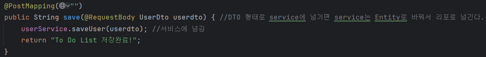

UserService🔻

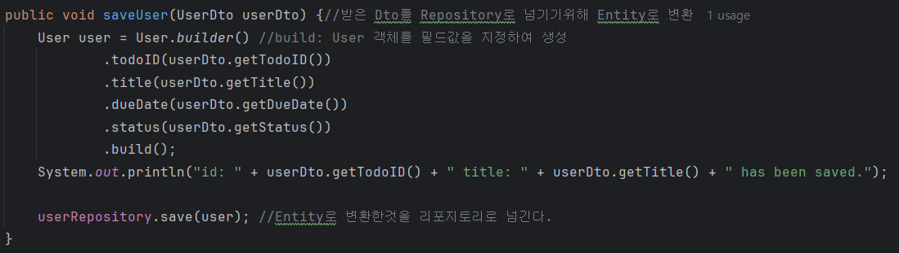

UserRepository🔻

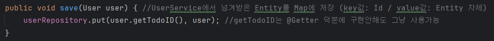

수행결과

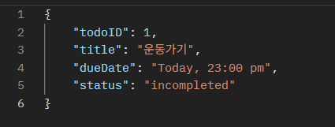

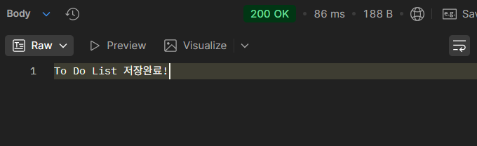

2. findById

🔻할일 목록의 id로 저장된 할일을 조회

🔻json형태로 리턴
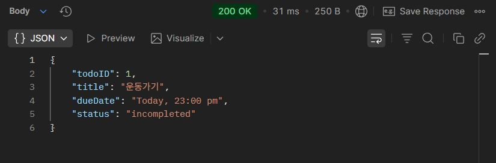

3. titleDueDate (할일의 제목과 마감기한 리턴)

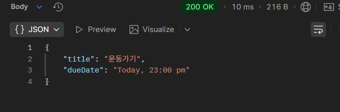

-> title과 DueDate 필드만 다루는 UserResponseDto가 사용됐습니다.

4. statusCheck

🔻완료/미완료 상태를 확인하기 위해 id로 조회

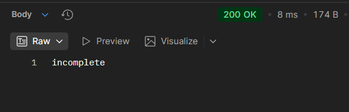

🔻Entity를 id로 조회 후 status필드 참조

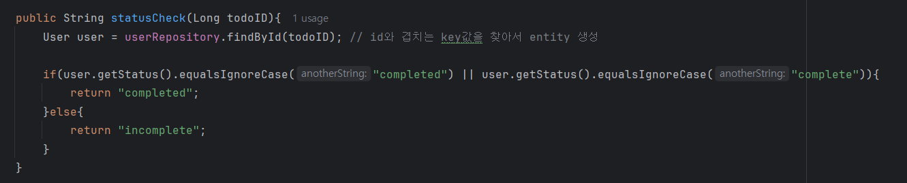

5. updateStatusById (complete / incomplete 상태 업데이트)

🔻"/{todoID}/{status}" => status부분에 complete/incomplete 기입

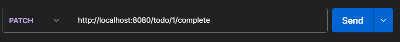

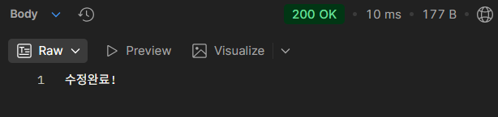

6. delete

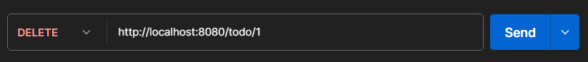

1번과제 운동하기가 삭제되고 파드과제만 남음

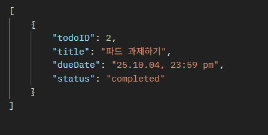

7. findall : 모든 리스트 출력

